### Objective:

Build an xG Model for soccer and analyze results using SHAP values

* With xG Model we get an estimate of how likely shot is to be a goal, and it can be used to evaluate teams/player performances.

* From an XGBoost GBM we lose interpretability, and we can use SHAP values to understand how the model uses certain features to generate predictions.


## Obtaining the Data
The data used was from StatsBomb Match Events, where data for some matches are provided for free.
The StatsBombR package was used to extract and load the data for all these matches:
(http://statsbomb.com/wp-content/uploads/2019/12/Using-StatsBomb-Data-In-R.pdf)


```r
# read in events using the StatsBombR package
StatsBombData <- StatsBombFreeEvents()
```

```
## [1] "Whilst we are keen to share data and facilitate research, we also urge you to be responsible with the data. Please credit StatsBomb as your data source when using the data and visit https://statsbomb.com/media-pack/ to obtain our logos for public use."
## [1] "Whilst we are keen to share data and facilitate research, we also urge you to be responsible with the data. Please credit StatsBomb as your data source when using the data and visit https://statsbomb.com/media-pack/ to obtain our logos for public use."
## [1] "Whilst we are keen to share data and facilitate research, we also urge you to be responsible with the data. Please credit StatsBomb as your data source when using the data and visit https://statsbomb.com/media-pack/ to obtain our logos for public use."
```

```r
# filter to shots
shots <- StatsBombData %>%
  filter(type.name == "Shot")

# filter to passes
passes <- StatsBombData %>%
  filter(type.name == "Pass")

# select relevant features for passes and rename for join to shots data
passes <- passes %>%
  select(id, location, pass.length, pass.angle, pass.end_location, pass.switch,pass.aerial_won, 
         pass.through_ball, pass.inswinging, pass.straight, pass.cross, pass.outswinging, 
         pass.cut_back, pass.deflected, pass.height.name, pass.body_part.name, pass.type.name) %>%
  rename("shot.key_pass_id" = "id",
         "pass_location" = "location")

# select relevant features for shots
shots_modeling <- shots %>%
  select(id, period, related_events, location, under_pressure, play_pattern.name, position.name, 
         shot.statsbomb_xg, shot.freeze_frame, shot.key_pass_id, shot.first_time, shot.aerial_won, 
         shot.technique.name, shot.body_part.id, shot.type.name, shot.outcome.name, competition_id,
         season_id)

# join pass and shot data
shots_modeling <- shots_modeling %>%
  left_join(passes, by = "shot.key_pass_id")
```

## Feature Creation for xG Model

In order to increase the predictive power of the xG Model, I have created a few features that I believe will be useful in determining the xG of a shot. 

#### Convert Location Into X and Y Coordinates


```r
# split shot location feature coordinates into new features
# extract the x and y coordinates from the original location feature
# turn them into their own variables for each
shots_modeling <- shots_modeling %>%
  mutate(location_x = str_extract(as.character(location), "[0-9]+.?[0-9]?,"),
         location_y = str_extract(as.character(location), "[0-9]+.?[0-9]?\\)"),
         location_x_shot = str_sub(location_x, 0, nchar(location_x) - 1),
         location_y_shot = str_sub(location_y, 0, nchar(location_y) - 1),
         location_x_pass = str_extract(as.character(pass_location), "[0-9]+.?[0-9]?,"),
         location_y_pass = str_extract(as.character(pass_location), "[0-9]+.?[0-9]?\\)"),
         location_x_pass = str_sub(location_x_pass, 0, nchar(location_x_pass) - 1),
         location_y_pass = str_sub(location_y_pass, 0, nchar(location_y_pass) - 1))
```

#### Distance to Goal

From the x and y coordinates, we can calculate the distance to the center of the goal using
the pythagorean theorem (in which the hypotenuse is the shot distance). The coordinates were referenced against page 34 on the StatsBomb documentation: https://github.com/statsbomb/open-data/blob/master/doc/StatsBomb%20Open%20Data%20Specification%20v1.1.pdf


```r
# create distance to goal 
shots_modeling <- shots_modeling %>%
  mutate(location_x_shot = as.numeric(location_x_shot),
         location_y_shot = as.numeric(location_y_shot),
         # the goals are located at the 0 and 120 coordinates for X,
         # and 40 for the Y coordinates
         goal_1_x = 0,
         goal_1_y = 40,
         goal_2_x = 120,
         goal_2_y = 40,
         # calculate the distance between the coordinates of the shots and the goals
         x_distance_goal_1 = abs(location_x_shot - goal_1_x),
         y_distance_goal_1 = abs(location_y_shot - goal_1_y),
         x_distance_goal_2 = abs(location_x_shot - goal_2_x),
         y_distance_goal_2 = abs(location_y_shot - goal_2_y))

# find nearest goal
shots_modeling <- shots_modeling %>%
  group_by(id) %>%
  mutate(x_shot_distance = min(x_distance_goal_1, x_distance_goal_2),
         # find the distance between the x coordinate and the nearest goal
         # this assumes that a player is shooting at the goal that is in the half
         # of the field that the shot was taken in
         y_shot_distance = y_distance_goal_1,
         # the y coordinate distance will be the same for both, as both goals are at 40
         shot_distance = sqrt((x_shot_distance ^ 2) + (y_shot_distance ^ 2))) 
         # use the pythagorean theorem to find the distance of the shot based
         # on the x and y coordinates
         # Note: this calculates the distance to the center of the goal, which
         # rarely is where the shot is actually directed, but is useful for 
         # estimating the distance of the shot

# remove vars that are not useful for modeling
remove_shot_vars <-c("x_shot_distance", "y_shot_distance", "goal_1_x", "goal_1_y",
                      "goal_2_x", "goal_2_y", "x_distance_goal_1", "x_distance_goal_2",
                      "y_distance_goal_1", "y_distance_goal_2", "location_x", "location_y", 
                      "location", "pass_location")

shots_modeling <- shots_modeling %>%
  select(-remove_shot_vars)
```

#### Pass Location

Using the end location of the pass prior to the shot, we can extract more contextual information
about the shot -- if the player took the shot a long distance away from the end pass location, we
know they must have been responsible for the movement and creation leading up to the shot. If the
pass ends close to the shot location, we know that information about the pass likely had a larger 
influence on the shot, and potentially its goal probability.


```r
# split location feature coordinates into new features
# extract the x and y coordinates from the original location feature
# turn them into their own variables for each
shots_modeling <- shots_modeling %>%
  mutate(pass_end_x = str_extract(as.character(pass.end_location), "[0-9]+.?[0-9]?,"),
         pass_end_y = str_extract(as.character(pass.end_location), "[0-9]+.?[0-9]?\\)"),
         pass_end_x = str_sub(pass_end_x, 0, nchar(pass_end_x) - 1),
         pass_end_y = str_sub(pass_end_y, 0, nchar(pass_end_y) - 1))
#,
shots_modeling <- shots_modeling %>%
  mutate(pass_end_x = as.numeric(pass_end_x),
         pass_end_y = as.numeric(pass_end_y),
         pass_end_x = replace_na(pass_end_x, location_x_shot),
         pass_end_y = replace_na(pass_end_y, location_y_shot),
         pass_end_x = as.numeric(pass_end_x),
         pass_end_y = as.numeric(pass_end_y),
         # calculate the distance between the pass and the shot
         shot_pass_diff_x = as.numeric(abs(location_x_shot - pass_end_x)),
         shot_pass_diff_y = as.numeric(abs(location_y_shot - pass_end_y)),
         shot_pass_diff = shot_pass_diff_x + shot_pass_diff_y)

# remove additional unnecessary features
other_remove_vars <- c("related_events", "shot.statsbomb_xg", "shot.freeze_frame",
                       "shot.key_pass_id", "competition_id", "season_id", "pass_end_x", 
                       "pass_end_y", "shot_pass_diff_x", "shot_pass_diff_y", "pass.end_location")

shots_modeling <- shots_modeling %>%
  select(-other_remove_vars)
```

#### Convert Position Feature

The original data about position players has lots of levels. I have collapsed similar position levels
to relative groups. This will help the model pick up on differences in shots from attackers versus 
defenders for example, compared to a right back versus a right wing back. 


```r
# count of shots by each individual position name 
positions <- as.data.frame(table(shots_modeling$position.name))
positions %>%
  rename("Position" = "Var1") %>%
  kableExtra::kbl() %>%
  kableExtra::kable_paper()
```

<table class=" lightable-paper" style='font-family: "Arial Narrow", arial, helvetica, sans-serif; margin-left: auto; margin-right: auto;'>
 <thead>
  <tr>
   <th style="text-align:left;"> Position </th>
   <th style="text-align:right;"> Freq </th>
  </tr>
 </thead>
<tbody>
  <tr>
   <td style="text-align:left;"> Center Attacking Midfield </td>
   <td style="text-align:right;"> 1869 </td>
  </tr>
  <tr>
   <td style="text-align:left;"> Center Back </td>
   <td style="text-align:right;"> 140 </td>
  </tr>
  <tr>
   <td style="text-align:left;"> Center Defensive Midfield </td>
   <td style="text-align:right;"> 820 </td>
  </tr>
  <tr>
   <td style="text-align:left;"> Center Forward </td>
   <td style="text-align:right;"> 5742 </td>
  </tr>
  <tr>
   <td style="text-align:left;"> Center Midfield </td>
   <td style="text-align:right;"> 65 </td>
  </tr>
  <tr>
   <td style="text-align:left;"> Goalkeeper </td>
   <td style="text-align:right;"> 4 </td>
  </tr>
  <tr>
   <td style="text-align:left;"> Left Attacking Midfield </td>
   <td style="text-align:right;"> 138 </td>
  </tr>
  <tr>
   <td style="text-align:left;"> Left Back </td>
   <td style="text-align:right;"> 1068 </td>
  </tr>
  <tr>
   <td style="text-align:left;"> Left Center Back </td>
   <td style="text-align:right;"> 1097 </td>
  </tr>
  <tr>
   <td style="text-align:left;"> Left Center Forward </td>
   <td style="text-align:right;"> 1889 </td>
  </tr>
  <tr>
   <td style="text-align:left;"> Left Center Midfield </td>
   <td style="text-align:right;"> 2159 </td>
  </tr>
  <tr>
   <td style="text-align:left;"> Left Defensive Midfield </td>
   <td style="text-align:right;"> 989 </td>
  </tr>
  <tr>
   <td style="text-align:left;"> Left Midfield </td>
   <td style="text-align:right;"> 1238 </td>
  </tr>
  <tr>
   <td style="text-align:left;"> Left Wing </td>
   <td style="text-align:right;"> 3644 </td>
  </tr>
  <tr>
   <td style="text-align:left;"> Left Wing Back </td>
   <td style="text-align:right;"> 225 </td>
  </tr>
  <tr>
   <td style="text-align:left;"> Right Attacking Midfield </td>
   <td style="text-align:right;"> 136 </td>
  </tr>
  <tr>
   <td style="text-align:left;"> Right Back </td>
   <td style="text-align:right;"> 1129 </td>
  </tr>
  <tr>
   <td style="text-align:left;"> Right Center Back </td>
   <td style="text-align:right;"> 1151 </td>
  </tr>
  <tr>
   <td style="text-align:left;"> Right Center Forward </td>
   <td style="text-align:right;"> 1916 </td>
  </tr>
  <tr>
   <td style="text-align:left;"> Right Center Midfield </td>
   <td style="text-align:right;"> 2102 </td>
  </tr>
  <tr>
   <td style="text-align:left;"> Right Defensive Midfield </td>
   <td style="text-align:right;"> 883 </td>
  </tr>
  <tr>
   <td style="text-align:left;"> Right Midfield </td>
   <td style="text-align:right;"> 1060 </td>
  </tr>
  <tr>
   <td style="text-align:left;"> Right Wing </td>
   <td style="text-align:right;"> 3641 </td>
  </tr>
  <tr>
   <td style="text-align:left;"> Right Wing Back </td>
   <td style="text-align:right;"> 217 </td>
  </tr>
  <tr>
   <td style="text-align:left;"> Secondary Striker </td>
   <td style="text-align:right;"> 47 </td>
  </tr>
</tbody>
</table>

```r
# group positions into useful categories 
attacker <- c("Secondary Striker", "Right Wing", "Left Wing", "Center Forward", 
              "Left Center Forwrd", "Right Center Forward")
midfielder <- c("Center Attacking Midfield", "Center Defensive Midfield", "Center Midfield",
                "Left Attacking Midfield", "Left Center Midfield", "Left Defensive Midfield",
                "Left Midfield", "Right Attacking Midfield", "Right Center Midfield", 
                "Right Defensive Midfield", "Right Midfield")
defender <- c("Center Back", "Left Back", "Left Center Back", "Left Wing Back",
              "Right Back", "Right Center Back", "Right Wing Back")
goalkeeper <- c("Goalkeeper")

# update modeling set
shots_modeling <- shots_modeling %>%
  mutate(attacker = ifelse(position.name %in% attacker, 1, 0),
         midfielder = ifelse(position.name %in% midfielder, 1, 0),
         defender = ifelse(position.name %in% defender, 1, 0),
         goalkeeper = ifelse(position.name %in% goalkeeper, 1, 0)) %>%
  select(-position.name)
```

#### Convert Shot Body Part Feature

```r
# convert shot body part from numeric to categorical
shots_modeling <- shots_modeling %>%
  mutate(shot.body_part.id = ifelse(shot.body_part.id == 37, "Head", 
                             ifelse(shot.body_part.id == 38, "Left_Foot",
                             ifelse(shot.body_part.id == 40, "Right_Foot", "Other"))))
```


#### Convert Feature Values

Some features come in one-hot encoding format from the original StatsBomb data. However they are 
listed as True/False, and the model needs this to be converted to binary (1,0) 


```r
# convert one-hot variables from TRUE/FALSE to binary format
shots_modeling <- shots_modeling %>%
  mutate(under_pressure = ifelse(under_pressure == TRUE, 1, 0),
         shot.first_time = ifelse(shot.first_time == TRUE, 1, 0),
         shot.aerial_won = ifelse(shot.aerial_won == TRUE, 1, 0),
         pass.switch = ifelse(pass.switch == 1, 0),
         pass.aerial_won = ifelse(pass.aerial_won == TRUE, 1, 0),
         pass.through_ball = ifelse(pass.through_ball == TRUE, 1, 0),
         pass.inswinging = ifelse(pass.inswinging == TRUE, 1, 0),
         pass.straight = ifelse(pass.straight == TRUE, 1, 0),
         pass.cross = ifelse(pass.cross == TRUE, 1, 0),
         pass.outswinging = ifelse(pass.outswinging == TRUE, 1, 0),
         pass.cut_back = ifelse(pass.cut_back == TRUE, 1, 0),
         pass.deflected = ifelse(pass.deflected == TRUE, 1, 0))

# replace NA values with 0 for relevant features
shots_modeling <- shots_modeling %>%
  mutate(under_pressure = replace_na(under_pressure, 0),
         shot.first_time = replace_na(shot.first_time, 0),
         shot.aerial_won = replace_na(shot.aerial_won, 0))

# convert target variable to binary format
shots_modeling <- shots_modeling %>%
  mutate(label = ifelse(shot.outcome.name == "Goal", 1, 0)) %>%
  select(-shot.outcome.name)

# convert features to numeric
shots_modeling <- shots_modeling %>%
  mutate(location_x_pass = as.numeric(location_x_pass),
         location_y_pass = as.numeric(location_y_pass)) %>%
  ungroup() %>%
  select(-id)

# print out structure of final modeling dataset
str(shots_modeling)
```

```
## tibble [33,369 × 33] (S3: tbl_df/tbl/data.frame)
##  $ period             : int [1:33369] 1 1 1 1 1 1 1 1 1 1 ...
##  $ under_pressure     : num [1:33369] 0 1 0 0 0 0 0 0 0 1 ...
##  $ play_pattern.name  : chr [1:33369] "Other" "Regular Play" "From Throw In" "From Keeper" ...
##  $ shot.first_time    : num [1:33369] 0 0 0 0 0 0 1 0 0 0 ...
##  $ shot.aerial_won    : num [1:33369] 0 0 0 0 0 0 0 0 0 0 ...
##  $ shot.technique.name: chr [1:33369] "Normal" "Normal" "Normal" "Normal" ...
##  $ shot.body_part.id  : chr [1:33369] "Left_Foot" "Right_Foot" "Right_Foot" "Left_Foot" ...
##  $ shot.type.name     : chr [1:33369] "Penalty" "Open Play" "Open Play" "Open Play" ...
##  $ pass.length        : num [1:33369] NA NA 17.63 4.47 27.25 ...
##  $ pass.angle         : num [1:33369] NA NA 1.451 1.751 -0.493 ...
##  $ pass.switch        : num [1:33369] NA NA NA NA NA 0 NA NA NA NA ...
##  $ pass.aerial_won    : num [1:33369] NA NA NA NA NA NA NA NA NA NA ...
##  $ pass.through_ball  : num [1:33369] NA NA NA NA NA NA NA NA NA NA ...
##  $ pass.inswinging    : num [1:33369] NA NA NA NA NA NA NA NA NA NA ...
##  $ pass.straight      : num [1:33369] NA NA NA NA NA NA NA NA NA NA ...
##  $ pass.cross         : num [1:33369] NA NA NA NA NA NA NA NA NA NA ...
##  $ pass.outswinging   : num [1:33369] NA NA NA NA NA NA NA NA NA NA ...
##  $ pass.cut_back      : num [1:33369] NA NA NA NA NA NA NA NA NA NA ...
##  $ pass.deflected     : num [1:33369] NA NA NA NA NA NA NA NA NA NA ...
##  $ pass.height.name   : chr [1:33369] NA NA "Ground Pass" "Ground Pass" ...
##  $ pass.body_part.name: chr [1:33369] NA NA "Right Foot" "Right Foot" ...
##  $ pass.type.name     : chr [1:33369] NA NA NA NA ...
##  $ location_x_shot    : num [1:33369] 108.2 91.9 90.2 95.2 113 ...
##  $ location_y_shot    : num [1:33369] 40.1 43.1 59.3 47.2 59.5 20.4 37.4 47.9 31.3 41.6 ...
##  $ location_x_pass    : num [1:33369] NA NA 77.1 93.1 91.8 22.5 NA NA NA 93.2 ...
##  $ location_y_pass    : num [1:33369] NA NA 36.2 52.4 80 49.1 NA NA NA 32.3 ...
##  $ shot_distance      : num [1:33369] 11.8 28.3 35.5 25.8 20.7 ...
##  $ shot_pass_diff     : num [1:33369] 0 0 16.6 12.5 10.4 ...
##  $ attacker           : num [1:33369] 1 0 0 1 1 0 1 0 1 1 ...
##  $ midfielder         : num [1:33369] 0 1 0 0 0 0 0 1 0 0 ...
##  $ defender           : num [1:33369] 0 0 1 0 0 1 0 0 0 0 ...
##  $ goalkeeper         : num [1:33369] 0 0 0 0 0 0 0 0 0 0 ...
##  $ label              : num [1:33369] 1 0 0 0 0 0 0 0 0 0 ...
```

```r
target <- as.data.frame(table(shots_modeling$label))

# print out target frequency
target %>%
  rename("Target" = "Var1") %>%
  kbl() %>%
  kable_paper(full_width = F)
```

<table class=" lightable-paper" style='font-family: "Arial Narrow", arial, helvetica, sans-serif; width: auto !important; margin-left: auto; margin-right: auto;'>
 <thead>
  <tr>
   <th style="text-align:left;"> Target </th>
   <th style="text-align:right;"> Freq </th>
  </tr>
 </thead>
<tbody>
  <tr>
   <td style="text-align:left;"> 0 </td>
   <td style="text-align:right;"> 29276 </td>
  </tr>
  <tr>
   <td style="text-align:left;"> 1 </td>
   <td style="text-align:right;"> 4093 </td>
  </tr>
</tbody>
</table>

## Building XGBoost GBM Model

As we are constructing an xG model, we want to build the model off of the training set, and have
a holdout set to test the model performance against. The code below splits the data into 70% 
training and 30% test, and preps it into the correct format for feeding into an XGBoost model. 


#### Data Prep for XGBoost


```r
# create own dataset for label
shots_label <- shots_modeling %>%
  select(label)

# remove target from dataset
shots_modeling_set <- shots_modeling %>%
  select(-label)

# create training and test set index (70/30)
shots_index <- createDataPartition(shots_modeling$label, 
                                   p = 0.7,
                                   list = FALSE)

# create one-hot encoded variables for categorical features
shots_dummy <- dummyVars(" ~ .", data = shots_modeling_set)
shots_dummy_df <- predict(shots_dummy, shots_modeling_set)

# split data into training and test set
shots_training <- shots_dummy_df[shots_index,]
shots_test <- shots_dummy_df[-shots_index,]

# split label into training and test set
shots_training_label <- shots_label[shots_index,]
shots_test_label <- shots_label[-shots_index,]

# convert into xgb DMatrix format
dtrain <- xgb.DMatrix(shots_training, label = shots_training_label$label)
dtest <- xgb.DMatrix(shots_test, label = shots_test_label$label)

# combine train and test for watchlist
watchlist <- list(train = dtrain, test = dtest)
```

#### Cross Validation for Hyperparameters

To find the optimal XGBoost hyperparameters for the xG Model, I ran a 5-fold CV on the training set.
Each CV run splits the training data into 5 equal 'folds' -- then a model is built off of 4 of the
folds, and its performance is tested against the one remaining fold. This is completed until the 
AUC on the test fold doesn't improve in 10 rounds. This is used to find the optimal number of trees,
and report an maximum AUC value to compare the sets of hyperparameter combinations.


```r
# create list of parameters for grid search 
params_1 <- list(objective = "binary:logistic", eval_metric = "error", eval_metric = "auc", 
                 verbose = 2, max_depth = 3, eta = 0.1)
params_2 <- list(objective = "binary:logistic", eval_metric = "error", eval_metric = "auc", 
                 verbose = 2, max_depth = 3, eta = 0.05)
params_3 <- list(objective = "binary:logistic", eval_metric = "error", eval_metric = "auc", 
                 verbose = 2, max_depth = 3, eta = 0.025)
params_4 <- list(objective = "binary:logistic", eval_metric = "error", eval_metric = "auc", 
                 verbose = 2, max_depth = 5, eta = 0.1)
params_5 <- list(objective = "binary:logistic", eval_metric = "error", eval_metric = "auc", 
                 verbose = 2, max_depth = 5, eta = 0.05)
params_6 <- list(objective = "binary:logistic", eval_metric = "error", eval_metric = "auc", 
                 verbose = 2, max_depth = 5, eta = 0.025)
params_7 <- list(objective = "binary:logistic", eval_metric = "error", eval_metric = "auc",
                 verbose = 2, max_depth = 7, eta = 0.1)
params_8 <- list(objective = "binary:logistic", eval_metric = "error", eval_metric = "auc",
                 verbose = 2, max_depth = 7, eta = 0.05)
params_9 <- list(objective = "binary:logistic", eval_metric = "error", eval_metric = "auc",
                 verbose = 2, max_depth = 7, eta = 0.025)

# cross-validation runs on training to find optimal hyperparameter set
cv_1 <- xgb.cv(params = params_1, early_stopping_rounds = 10, nrounds = 1000, 
               data = dtrain, nfold = 5, verbose = 0)
cv_2 <- xgb.cv(params = params_2, early_stopping_rounds = 10, nrounds = 1000, 
               data = dtrain, nfold = 5, verbose = 0)
cv_3 <- xgb.cv(params = params_3, early_stopping_rounds = 10, nrounds = 1000, 
               data = dtrain, nfold = 5, verbose = 0)
cv_4 <- xgb.cv(params = params_4, early_stopping_rounds = 10, nrounds = 1000, 
               data = dtrain, nfold = 5, verbose = 0)
cv_5 <- xgb.cv(params = params_5, early_stopping_rounds = 10, nrounds = 1000, 
               data = dtrain, nfold = 5, verbose = 0)
cv_6 <- xgb.cv(params = params_6, early_stopping_rounds = 10, nrounds = 1000, 
               data = dtrain, nfold = 5, verbose = 0)
cv_7 <- xgb.cv(params = params_7, early_stopping_rounds = 10, nrounds = 1000, 
               data = dtrain, nfold = 5, verbose = 0)
cv_8 <- xgb.cv(params = params_8, early_stopping_rounds = 10, nrounds = 1000, 
               data = dtrain, nfold = 5, verbose = 0)
cv_9 <- xgb.cv(params = params_9, early_stopping_rounds = 10, nrounds = 1000, 
               data = dtrain, nfold = 5, verbose = 0)

# find max of cv test AUC 
print(paste0("Max AUC of cv 1: ",max(cv_1$evaluation_log$test_auc_mean)))
```

```
## [1] "Max AUC of cv 1: 0.801635717700565"
```

```r
print(paste0("Max AUC of cv 2: ",max(cv_2$evaluation_log$test_auc_mean)))
```

```
## [1] "Max AUC of cv 2: 0.800968541738916"
```

```r
print(paste0("Max AUC of cv 3: ",max(cv_3$evaluation_log$test_auc_mean)))
```

```
## [1] "Max AUC of cv 3: 0.801504971502444"
```

```r
print(paste0("Max AUC of cv 4: ",max(cv_4$evaluation_log$test_auc_mean)))
```

```
## [1] "Max AUC of cv 4: 0.800439726570642"
```

```r
print(paste0("Max AUC of cv 5: ",max(cv_5$evaluation_log$test_auc_mean)))
```

```
## [1] "Max AUC of cv 5: 0.802165764443433"
```

```r
print(paste0("Max AUC of cv 6: ",max(cv_6$evaluation_log$test_auc_mean)))
```

```
## [1] "Max AUC of cv 6: 0.8018109766313"
```

```r
print(paste0("Max AUC of cv 7: ",max(cv_7$evaluation_log$test_auc_mean)))
```

```
## [1] "Max AUC of cv 7: 0.795176272534976"
```

```r
print(paste0("Max AUC of cv 8: ",max(cv_8$evaluation_log$test_auc_mean)))
```

```
## [1] "Max AUC of cv 8: 0.796221747139652"
```

```r
print(paste0("Max AUC of cv 9: ",max(cv_9$evaluation_log$test_auc_mean)))
```

```
## [1] "Max AUC of cv 9: 0.795208588592714"
```

We use AUC as the evaluation metric for this model as it emphasizes ranking - we want to be able to better rank shots that are more likely to be a goal, compared to those that are not.

#### Model Build

We want to build the XGBoost model with the optimal number of trees as determined by the CV:


```r
# highest is parameter list 1 
print(paste("Optimal number of trees from CV:", cv_6$niter - 10))
```

```
## [1] "Optimal number of trees from CV: 304"
```

```r
ntrees = cv_1$niter - 10
```

The optimal parameters came from CV set 1: those were then used to construct an XGBoost model.


```r
# rebuild model with optimal parameters
model_1 <- xgb.train(data = dtrain, nrounds = ntrees, params = params_6, watchlist = watchlist, verbose = 0)
```

```
## [16:43:47] WARNING: src/learner.cc:767: 
## Parameters: { "verbose" } are not used.
```

We want to check that the model performance is similar on the test set and the cross-validation:


```r
print(paste0("Holdout Set AUC: ", max(model_1$evaluation_log$test_auc)))
```

```
## [1] "Holdout Set AUC: 0.791609767350658"
```

```r
print(paste0("CV Set AUC: ", max(cv_6$evaluation_log$test_auc_mean)))
```

```
## [1] "CV Set AUC: 0.8018109766313"
```

#### Model Performance

As the goal probability is the most important metric in the xG model evaluation, we can look at the model shot xG distributions to see if they follow an expected pattern. We expect to see a 
distributions skewed right with the majority of shots having a low probability of being a goal, and a small number with a high probability.


```r
# get predictions for all shots taken
predictions <- as.data.frame(predict(model_1, shots_dummy_df))

predictions <- cbind(predictions, shots_label)

predictions <- predictions %>%
  mutate(prediction = `predict(model_1, shots_dummy_df)`) %>%
  mutate(predicted_value = as.factor(ifelse(prediction > 0.5, 1, 0)),
         label = as.factor(label))

# plot density distribution of xG
ggplot(data = predictions) + 
  geom_density(aes(x = prediction), color = "black", fill = "grey", alpha = 0.5) +
  scale_x_continuous(limits = c(0, 1), breaks = seq(0, 1, .1)) + 
  labs(title = "Density of xG Distributions",
       subtitle = "Scores From All Shot Data",
       x = "xG",
       y = "Density") + 
  theme_minimal()
```

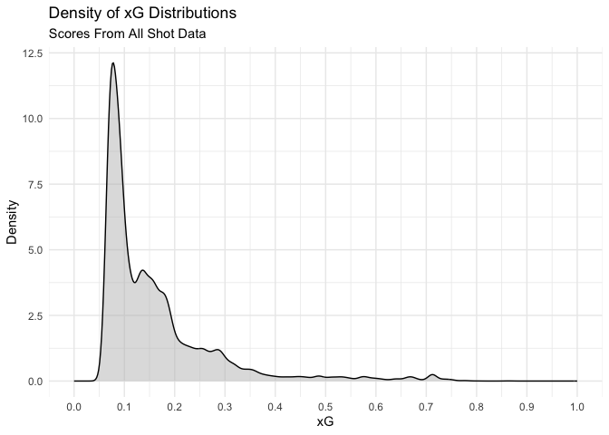<!-- -->

```r
# plot histogram of xG
ggplot(data = predictions) + 
  geom_histogram(aes(x = prediction), binwidth = .1, color = "black", fill = "blue") +
  scale_x_continuous(limits = c(-.05, 1.05), breaks = seq(0, 1, 0.1)) + 
  labs(title = "Histogram of xG Distributions",
       subtitle = "Scores From All Shot Data",
       x = "xG",
       y = "Shot Count") + 
  theme_minimal()
```

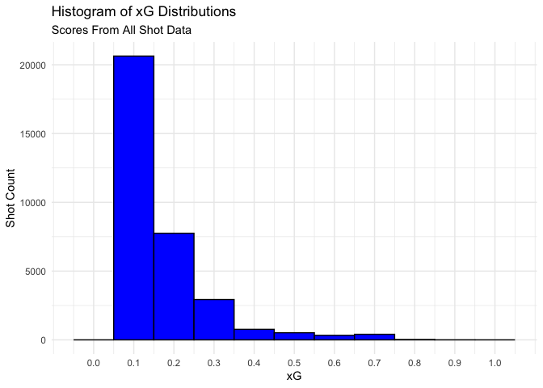<!-- -->

If our model performs well, we would expect it to be able to associate shots with a high xG with actual goals, and shots with a low xG with non-goals. To validate this, we can break out the xG values by goals and non-goals.


```r
# create separate datasets for positive and negative predictions from the model
positives <- predictions %>%
  filter(predicted_value == 1)
negatives <- predictions %>%
  filter(predicted_value == 0)

# convert binary label to interpretation for plotting
predictions <- predictions %>%
  mutate(pred_value = ifelse(label == 1, "Goal","No Goal"))
ggplot() + 
  geom_density(aes(x = prediction, group=pred_value, fill = pred_value), color = "black", alpha = 0.5, data = predictions) +
  scale_x_continuous(limits = c(0, 1), breaks = seq(0, 1, .1)) + 
  labs(title = "Density of xG Distributions",
       subtitle = "Scores From All Shot Data",
       x = "xG",
       y = "Density") + 
  theme_minimal()
```

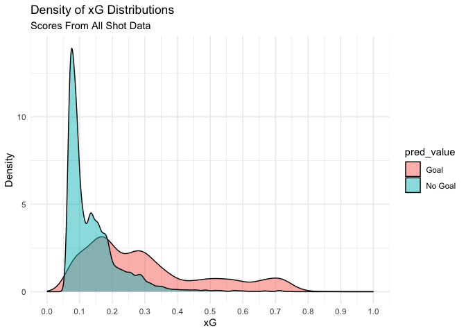<!-- -->

We can see from the distributions that the model associates the majority of non-goals with low xG values (< 0.3), while the majority of larger xG values (> 0.3) are associated with shots resulting in goals. This tells us that the model is performing reasonably well at identifying shots that resulted in goals, and associating higher xG values with shots that resulted in goals. 

## Feature Importance of GBM Model

After constructing the xG Model, we want to understand what features are deemed 'important'. As the model is a GBM, there is a less clear view of what the model is using to create predictions 
compared to a GLM.

* Gain - Measures the average error decrease when splitting on a feature. This metric is biased 
         towards features that are split on further down in the tree, and gives them more credit.
         
* Permutation - Measures the model error increase when a feature is permuted, or modified. While a 
                more reliable importance measure, it can run into issues with correlated features,
                as well as changing feature values to represent unrealistic values.

* SHAP - Measures the individual contribution that each feature provides to a single prediction. 

#### Gain


```r
# take top 10 features with highest gain
importance <- xgb.importance(model = model_1)
importance <- importance %>%
  select(Feature, Gain) %>%
  head(10)

# plot Gain Feature Importance
ggplot(data = importance) + 
  geom_bar(aes(x = Gain, y = fct_reorder(Feature, Gain), fill = Gain), stat = "identity") + 
  theme_minimal() + 
  theme(legend.position = "none") + 
  labs(title = "Feature Importance: Gain Metric",
       subtitle = "For Top 10 Features",
       x = "Gain",
       y = "")
```

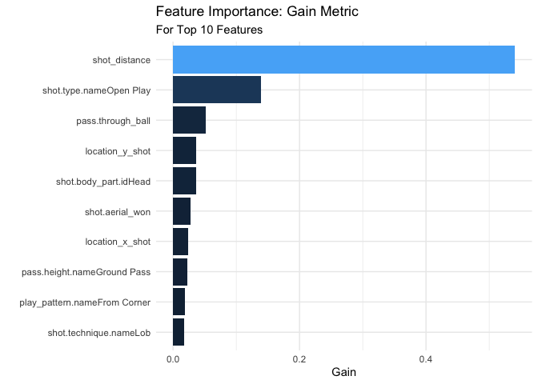<!-- -->

#### Permutation Importance


```r
# calculate permutation importance
model_perm_imp <- vip(object = model_1, method = "permute", target = shots_training_label, 
                      nsim = 5, train = shots_training, metric = "auc", 
                      pred_wrapper = predict, reference_class = 1)

perm_data <- model_perm_imp$data

# plot permutation importance
ggplot(data = perm_data) + 
  geom_bar(aes(x = Importance, y = fct_reorder(Variable, Importance), fill = Importance), 
           stat = "identity") + 
  theme_minimal() + 
  theme(legend.position = "none") + 
  labs(title = "Feature Importance: Permutation",
       subtitle = "For Top 10 Features",
       x = "Importance",
       y = "")
```

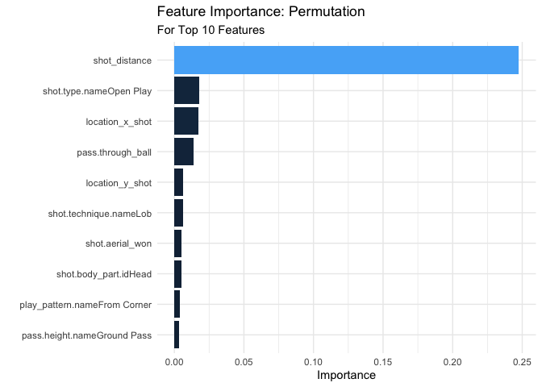<!-- -->

#### SHAP Values 

More details on SHAP value calculations can be found here: https://christophm.github.io/interpretable-ml-book/shap.html


```r
# calculate SHAP values for top 10 features
shots_long <- shap.prep(xgb_model = model_1, X_train = shots_dummy_df, top_n = 10)

# convert missing values to binary so plot has correct colors for shot open play feature
shots_long$rfvalue <- replace_na(shots_long$rfvalue, 0)
shots_long <- shots_long %>%
  mutate(stdfvalue = coalesce(stdfvalue, rfvalue))

# plot SHAP values 
shap.plot.summary(shots_long)
```

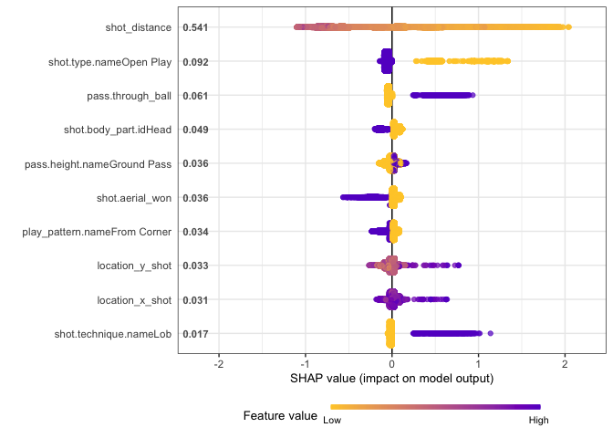<!-- -->

From these feature importance plots, we are looking for a few things.

First, we see that all three measures of importance generally line up, which gives us more confidence in our understanding of what features the model is picking up on, and what is generally more useful for making predictions. All three measures of importance deem the shot_distance as the most important feature, so we can be reasonably confident that this is a useful predictor. Open Play shots, location_x and location_y, as well as Through Ball passes are also consistently high on the importance list.

What differentiates SHAP from the first two importance measures is the ability to dig deeper with importance explanations. In permutation importance and gain, we understand how important a feature is relative to the others - but not what the feature does to make it important - questions such as are higher/lower values more predictive, and what is the spread across all values compared to just the average? These are questions that SHAP values allow us to answer. The summary plot above plots the feature value and the SHAP importance for each data point used, so we can not only see the spread of values across features relative to the average, but also if a high/low feature value has a varying impact.

#### SHAP Dependence Plots

With SHAP dependence plots we can drill deeper than the summary plot into individual features we find to be of high importance. These plots show the feature values on the X axis, and the SHAP importance on the y axis, showing us the impact of the feature value on importance.


```r
# Shot Distance 
shap.plot.dependence(data_long = shots_long, x = 'shot_distance', y = 'shot_distance', 
                     color_feature = 'shot_distance') 
```

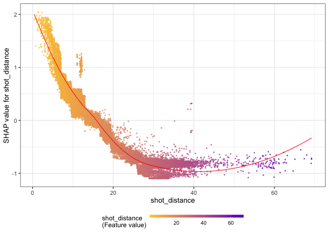<!-- -->

From the overall SHAP plot the shot_distance feature was deemed the most important. As expected, this plot demonstrates that shots taken closer to the goal have higher SHAP values, meaning they contribute positively to the predictions. 

We can also use this plot to define certain cutoffs - shots from 5 yards or less have the highest contribution to the overall prediction, shots from 5-15 yards still contribute positively, and shots from further than 15 yards start to decrease the overall predicted xG value.


```r
# Shot Y Coordinate Location
shap.plot.dependence(data_long = shots_long, x = 'location_y_shot', y = 'location_y_shot', color_feature = 'location_y_shot') + 
  geom_vline(xintercept = 36, color = "black") + 
  geom_vline(xintercept = 44, color = "black")
```

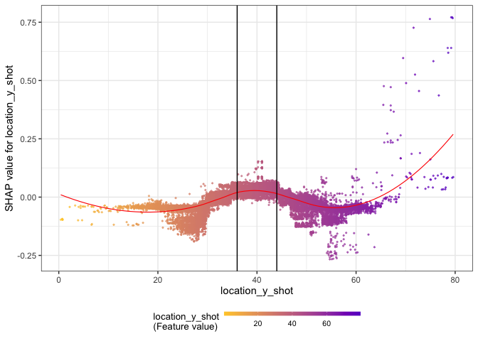<!-- -->

We can also look more specifically at the Y coordinate from where the shot was taken. The black vertical lines in the plot above represent the coordinates for the goal posts. As we can see, shots taken within the goal posts contribute to a higher xG than shots taken outside the goal posts. 


```r
# Shot Type Open Play
shap.plot.dependence(data_long = shots_long, x = "pass.through_ball", y = "pass.through_ball", color_feature = "pass.through_ball")
```

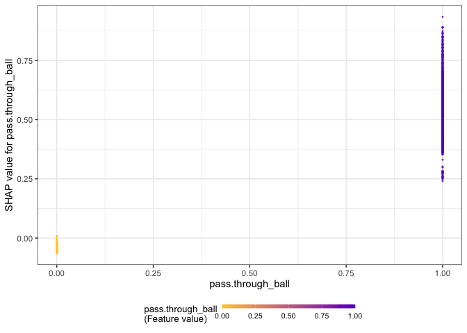<!-- -->

SHAP dependence plots can also be used on binary features. This plot tells us that passes that are through balls contribute to a higher xG. However, we also see that there is a wide range on these, ranging from 0.25 to just under 1. We can interpret this as we are confident that through ball passes contribute to a higher xG, however due to the spread we are not very confident as to how much exactly the feature contributes.

#### Local SHAP Prediction


```r
# create a shapviz object
shp <- shapviz(model_1, X_pred = data.matrix(shots_dummy_df), X = shots_dummy_df)

# plot an individual waterfall plot
sv_waterfall(shp, row_id = 1)
```

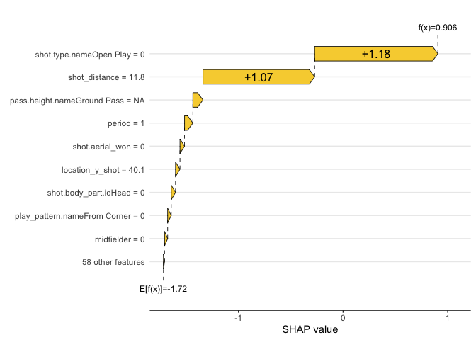<!-- -->

```r
# filter to the first row of data to show data values
individual_data <- shots_dummy_df %>%
  head(1)

individual_data %>%
  kbl() %>%
  kable_paper() %>%
  scroll_box(width = "500px")
```

<div style="border: 1px solid #ddd; padding: 5px; overflow-x: scroll; width:500px; "><table class=" lightable-paper" style='font-family: "Arial Narrow", arial, helvetica, sans-serif; margin-left: auto; margin-right: auto;'>
 <thead>
  <tr>
   <th style="text-align:right;"> period </th>
   <th style="text-align:right;"> under_pressure </th>
   <th style="text-align:right;"> play_pattern.nameFrom Corner </th>
   <th style="text-align:right;"> play_pattern.nameFrom Counter </th>
   <th style="text-align:right;"> play_pattern.nameFrom Free Kick </th>
   <th style="text-align:right;"> play_pattern.nameFrom Goal Kick </th>
   <th style="text-align:right;"> play_pattern.nameFrom Keeper </th>
   <th style="text-align:right;"> play_pattern.nameFrom Kick Off </th>
   <th style="text-align:right;"> play_pattern.nameFrom Throw In </th>
   <th style="text-align:right;"> play_pattern.nameOther </th>
   <th style="text-align:right;"> play_pattern.nameRegular Play </th>
   <th style="text-align:right;"> shot.first_time </th>
   <th style="text-align:right;"> shot.aerial_won </th>
   <th style="text-align:right;"> shot.technique.nameBackheel </th>
   <th style="text-align:right;"> shot.technique.nameDiving Header </th>
   <th style="text-align:right;"> shot.technique.nameHalf Volley </th>
   <th style="text-align:right;"> shot.technique.nameLob </th>
   <th style="text-align:right;"> shot.technique.nameNormal </th>
   <th style="text-align:right;"> shot.technique.nameOverhead Kick </th>
   <th style="text-align:right;"> shot.technique.nameVolley </th>
   <th style="text-align:right;"> shot.body_part.idHead </th>
   <th style="text-align:right;"> shot.body_part.idLeft_Foot </th>
   <th style="text-align:right;"> shot.body_part.idOther </th>
   <th style="text-align:right;"> shot.body_part.idRight_Foot </th>
   <th style="text-align:right;"> shot.type.nameCorner </th>
   <th style="text-align:right;"> shot.type.nameFree Kick </th>
   <th style="text-align:right;"> shot.type.nameKick Off </th>
   <th style="text-align:right;"> shot.type.nameOpen Play </th>
   <th style="text-align:right;"> shot.type.namePenalty </th>
   <th style="text-align:right;"> pass.length </th>
   <th style="text-align:right;"> pass.angle </th>
   <th style="text-align:right;"> pass.switch </th>
   <th style="text-align:right;"> pass.aerial_won </th>
   <th style="text-align:right;"> pass.through_ball </th>
   <th style="text-align:right;"> pass.inswinging </th>
   <th style="text-align:right;"> pass.straight </th>
   <th style="text-align:right;"> pass.cross </th>
   <th style="text-align:right;"> pass.outswinging </th>
   <th style="text-align:right;"> pass.cut_back </th>
   <th style="text-align:right;"> pass.deflected </th>
   <th style="text-align:right;"> pass.height.nameGround Pass </th>
   <th style="text-align:right;"> pass.height.nameHigh Pass </th>
   <th style="text-align:right;"> pass.height.nameLow Pass </th>
   <th style="text-align:right;"> pass.body_part.nameDrop Kick </th>
   <th style="text-align:right;"> pass.body_part.nameHead </th>
   <th style="text-align:right;"> pass.body_part.nameKeeper Arm </th>
   <th style="text-align:right;"> pass.body_part.nameLeft Foot </th>
   <th style="text-align:right;"> pass.body_part.nameNo Touch </th>
   <th style="text-align:right;"> pass.body_part.nameOther </th>
   <th style="text-align:right;"> pass.body_part.nameRight Foot </th>
   <th style="text-align:right;"> pass.type.nameCorner </th>
   <th style="text-align:right;"> pass.type.nameFree Kick </th>
   <th style="text-align:right;"> pass.type.nameGoal Kick </th>
   <th style="text-align:right;"> pass.type.nameInterception </th>
   <th style="text-align:right;"> pass.type.nameKick Off </th>
   <th style="text-align:right;"> pass.type.nameRecovery </th>
   <th style="text-align:right;"> pass.type.nameThrow-in </th>
   <th style="text-align:right;"> location_x_shot </th>
   <th style="text-align:right;"> location_y_shot </th>
   <th style="text-align:right;"> location_x_pass </th>
   <th style="text-align:right;"> location_y_pass </th>
   <th style="text-align:right;"> shot_distance </th>
   <th style="text-align:right;"> shot_pass_diff </th>
   <th style="text-align:right;"> attacker </th>
   <th style="text-align:right;"> midfielder </th>
   <th style="text-align:right;"> defender </th>
   <th style="text-align:right;"> goalkeeper </th>
  </tr>
 </thead>
<tbody>
  <tr>
   <td style="text-align:right;"> 1 </td>
   <td style="text-align:right;"> 0 </td>
   <td style="text-align:right;"> 0 </td>
   <td style="text-align:right;"> 0 </td>
   <td style="text-align:right;"> 0 </td>
   <td style="text-align:right;"> 0 </td>
   <td style="text-align:right;"> 0 </td>
   <td style="text-align:right;"> 0 </td>
   <td style="text-align:right;"> 0 </td>
   <td style="text-align:right;"> 1 </td>
   <td style="text-align:right;"> 0 </td>
   <td style="text-align:right;"> 0 </td>
   <td style="text-align:right;"> 0 </td>
   <td style="text-align:right;"> 0 </td>
   <td style="text-align:right;"> 0 </td>
   <td style="text-align:right;"> 0 </td>
   <td style="text-align:right;"> 0 </td>
   <td style="text-align:right;"> 1 </td>
   <td style="text-align:right;"> 0 </td>
   <td style="text-align:right;"> 0 </td>
   <td style="text-align:right;"> 0 </td>
   <td style="text-align:right;"> 1 </td>
   <td style="text-align:right;"> 0 </td>
   <td style="text-align:right;"> 0 </td>
   <td style="text-align:right;"> 0 </td>
   <td style="text-align:right;"> 0 </td>
   <td style="text-align:right;"> 0 </td>
   <td style="text-align:right;"> 0 </td>
   <td style="text-align:right;"> 1 </td>
   <td style="text-align:right;"> NA </td>
   <td style="text-align:right;"> NA </td>
   <td style="text-align:right;"> NA </td>
   <td style="text-align:right;"> NA </td>
   <td style="text-align:right;"> NA </td>
   <td style="text-align:right;"> NA </td>
   <td style="text-align:right;"> NA </td>
   <td style="text-align:right;"> NA </td>
   <td style="text-align:right;"> NA </td>
   <td style="text-align:right;"> NA </td>
   <td style="text-align:right;"> NA </td>
   <td style="text-align:right;"> NA </td>
   <td style="text-align:right;"> NA </td>
   <td style="text-align:right;"> NA </td>
   <td style="text-align:right;"> NA </td>
   <td style="text-align:right;"> NA </td>
   <td style="text-align:right;"> NA </td>
   <td style="text-align:right;"> NA </td>
   <td style="text-align:right;"> NA </td>
   <td style="text-align:right;"> NA </td>
   <td style="text-align:right;"> NA </td>
   <td style="text-align:right;"> NA </td>
   <td style="text-align:right;"> NA </td>
   <td style="text-align:right;"> NA </td>
   <td style="text-align:right;"> NA </td>
   <td style="text-align:right;"> NA </td>
   <td style="text-align:right;"> NA </td>
   <td style="text-align:right;"> NA </td>
   <td style="text-align:right;"> 108.2 </td>
   <td style="text-align:right;"> 40.1 </td>
   <td style="text-align:right;"> NA </td>
   <td style="text-align:right;"> NA </td>
   <td style="text-align:right;"> 11.80042 </td>
   <td style="text-align:right;"> 0 </td>
   <td style="text-align:right;"> 1 </td>
   <td style="text-align:right;"> 0 </td>
   <td style="text-align:right;"> 0 </td>
   <td style="text-align:right;"> 0 </td>
  </tr>
</tbody>
</table></div>

These individidual visualizations help us understand how feature values for an individual data point contribute to the overall prediction. Here we see that The shot not coming from open play but rather from a penalty, as well as the closer distance of 11.8 yards, contributed strongly and positively to the predicted value. The only feature that decreased the predicted value, albeit slightly, is the shot being taken with the left foot. 

## GLM Model

For comparison, we also can look at the performance and predictions of a GLM model, and how they compare to the GBM model. The model training follows the same train/test split as the GBM Model, and adds in a few slight modifications to the features. 


```r
# convert NA's to values in order to input into the GLM model
shots_modeling_glm <- shots_modeling %>%
  mutate(pass.switch = ifelse(pass.switch == 0, 1, 0),
         pass.switch = replace_na(pass.switch, 0),
         pass.aerial_won = replace_na(pass.aerial_won, 0),
         pass.through_ball = replace_na(pass.through_ball, 0),
         pass.inswinging = replace_na(pass.inswinging, 0),
         pass.straight = replace_na(pass.straight, 0),
         pass.cross = replace_na(pass.cross, 0),
         pass.outswinging = replace_na(pass.outswinging, 0),
         pass.cut_back = replace_na(pass.cut_back, 0),
         pass.deflected = replace_na(pass.deflected, 0),
         pass.height.name = replace_na(pass.height.name, "No Pass"),
         pass.body_part.name = replace_na(pass.body_part.name, "No Pass"),
         pass.type.name = replace_na(pass.type.name, "No Pass"),
         location_x_pass = replace_na(location_x_pass, 0),
         location_y_pass = replace_na(location_y_pass, 0),
         pass.length = replace_na(pass.length, 0),
         pass.angle = replace_na(pass.angle, 0))

shots_modeling_glm_label <- shots_modeling_glm %>%
  select(label)

# create train and test split
shots_training_glm <- shots_modeling_glm[shots_index,]
shots_test_glm <- shots_modeling_glm[-shots_index,]

# build GLM model as a logistic regression
xg_glm <- glm(label ~., data = shots_training_glm, family = "binomial")
```

#### Model Performance


```r
# create full dataset without target for scoring predictions
shots_modeling_glm_data <- shots_modeling_glm %>%
  select(-label)

# get full model scores
glm_predictions <- as.data.frame(predict(xg_glm, shots_modeling_glm_data, type="response"))
```

```
## Warning in predict.lm(object, newdata, se.fit, scale = 1, type = if (type == :
## prediction from a rank-deficient fit may be misleading
```

```r
glm_predictions <- cbind(glm_predictions, shots_modeling_glm_label)
glm_predictions <- glm_predictions %>%
  mutate(prediction = `predict(xg_glm, shots_modeling_glm_data, type = "response")`) %>%
  # 0.3 was determined to be the optimal cutoff value
  mutate(predicted_value = as.factor(ifelse(prediction > 0.3, 1, 0)),
         label = as.factor(label))

# plot density distribution of xG
ggplot(data = glm_predictions) + 
  geom_density(aes(x = prediction), color = "black", fill = "grey", alpha = 0.5) +
  scale_x_continuous(limits = c(0, 1), breaks = seq(0, 1, .1)) + 
  labs(title = "Density of xG Distributions",
       subtitle = "Scores From All Shot Data",
       x = "xG",
       y = "Density") + 
  theme_minimal()
```

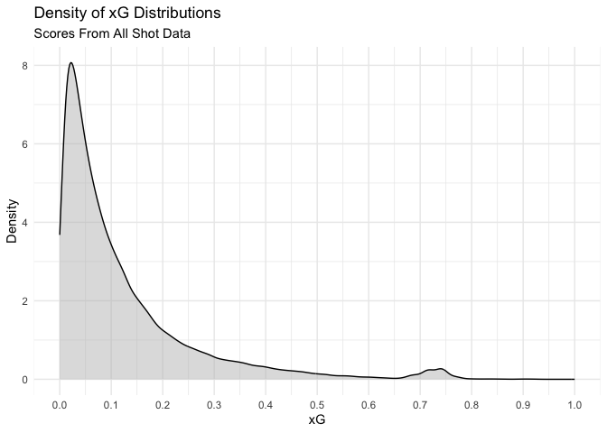<!-- -->

```r
# create separate datasets for positive and negative predictions from the model
glm_positives <- glm_predictions %>%
  filter(predicted_value == 1)
glm_negatives <- glm_predictions %>%
  filter(predicted_value == 0)

# convert binary label to interpretation for plotting
glm_predictions <- glm_predictions %>%
  mutate(pred_value = ifelse(label == 1, "Goal","No Goal"))

# plot 
ggplot() + 
  geom_density(aes(x = prediction, group=pred_value, fill = pred_value), color = "black", alpha = 0.5, data = glm_predictions) +
  scale_x_continuous(limits = c(0, 1), breaks = seq(0, 1, .1)) + 
  labs(title = "Density of xG Distributions",
       subtitle = "Scores From All Shot Data",
       x = "xG",
       y = "Density") + 
  theme_minimal()
```

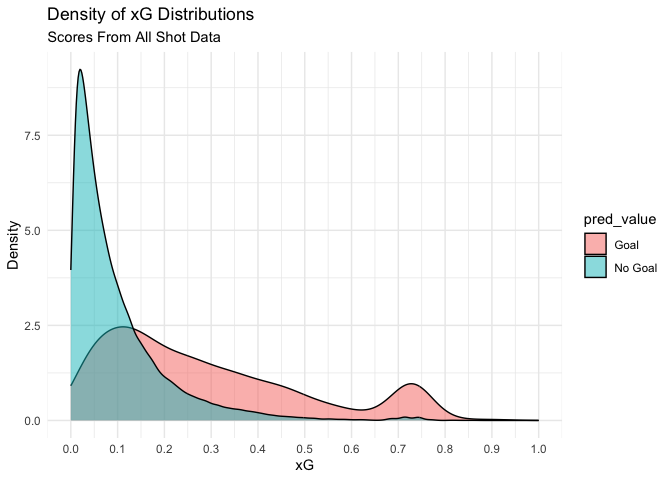<!-- -->

As with the GBM Model, we can see that there is differentiation between predicted goals and not goals. The model associates the majority of non-goals with low xG values (<0.3), while associating higher xG values with goals, again showing us that the model is performing reasonably well at separating the two classes.

#### ROC Curve


```r
pROC_obj <- roc(glm_predictions$label, glm_predictions$prediction,
            smoothed = TRUE,
            # arguments for ci
            ci=TRUE, ci.alpha=0.9, stratified=FALSE,
            # arguments for plot
            plot=TRUE, auc.polygon=TRUE, max.auc.polygon=TRUE, grid=TRUE,
            print.auc=TRUE, show.thres=TRUE)
```

```
## Setting levels: control = 0, case = 1
```

```
## Setting direction: controls < cases
```

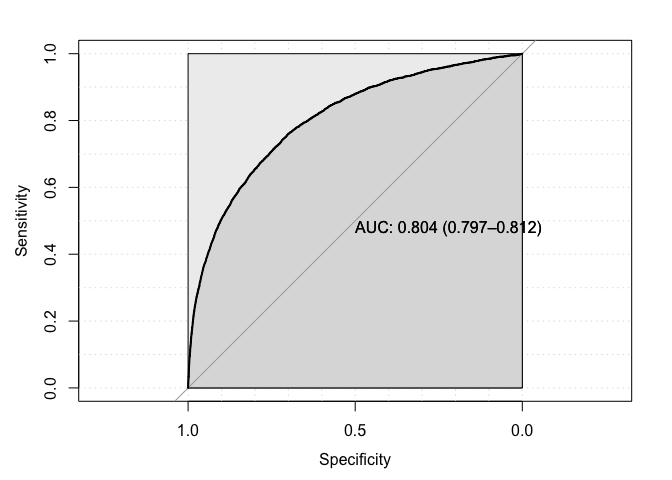<!-- -->

The model performs approximately the same as the GBM when looking at the AUC value. Again AUC is a major metric for analyzing model performance, as the rank of predictions is relevant in this context.

#### Confusion Matrix


```r
# create confusion matrix
confusionMatrix(as.factor(glm_predictions$predicted_value), as.factor(shots_modeling_glm_label$label), positive = '1')
```

```
## Confusion Matrix and Statistics
## 
##           Reference
## Prediction     0     1
##          0 27692  2520
##          1  1584  1573
##                                              
##                Accuracy : 0.877              
##                  95% CI : (0.8734, 0.8805)   
##     No Information Rate : 0.8773             
##     P-Value [Acc > NIR] : 0.5769             
##                                              
##                   Kappa : 0.3662             
##                                              
##  Mcnemar's Test P-Value : <0.0000000000000002
##                                              
##             Sensitivity : 0.38431            
##             Specificity : 0.94589            
##          Pos Pred Value : 0.49826            
##          Neg Pred Value : 0.91659            
##              Prevalence : 0.12266            
##          Detection Rate : 0.04714            
##    Detection Prevalence : 0.09461            
##       Balanced Accuracy : 0.66510            
##                                              
##        'Positive' Class : 1                  
## 
```

Looking at the confusion matrix we see that using a cutoff of 0.3 provides the overall highest model accuracy. However with this cutoff value we have a slightly imbalanced specificity/sensitivity. While our specificity is high (the model performs well at identifying shots that are not goals), the sensitivity is low (the model performs worse at identifying shots that are goals). If we want to have a more balanced view between the sensitivity and specificity, we can lower the cutoff value from 0.3.

## Feature Importance

Feature importance in a logistic regression is more straightforward than in a GBM model. The first thing we will look at is the odds ratio, which is calculated by taking the exponent of the coefficients from the GLM model.


```r
# calculate odds ratio by taking exponent of coefficient
xg_glm_coefs <- as.data.frame(xg_glm$coefficients)
xg_glm_coefs <- xg_glm_coefs %>%
  mutate(odds_ratio = exp(`xg_glm$coefficients`),
         feature_name = row.names(xg_glm_coefs))

# print out odds ratio labels
xg_glm_coefs %>%
  arrange(desc(odds_ratio)) %>%
  kbl() %>%
  kable_paper(fixed_thead = T) %>%
  scroll_box(height = "500px")
```

<div style="border: 1px solid #ddd; padding: 0px; overflow-y: scroll; height:500px; "><table class=" lightable-paper" style='font-family: "Arial Narrow", arial, helvetica, sans-serif; margin-left: auto; margin-right: auto;'>
 <thead>
  <tr>
   <th style="text-align:left;position: sticky; top:0; background-color: #FFFFFF;position: sticky; top:0; background-color: #FFFFFF;">   </th>
   <th style="text-align:right;position: sticky; top:0; background-color: #FFFFFF;position: sticky; top:0; background-color: #FFFFFF;"> xg_glm$coefficients </th>
   <th style="text-align:right;position: sticky; top:0; background-color: #FFFFFF;position: sticky; top:0; background-color: #FFFFFF;"> odds_ratio </th>
   <th style="text-align:left;position: sticky; top:0; background-color: #FFFFFF;position: sticky; top:0; background-color: #FFFFFF;"> feature_name </th>
  </tr>
 </thead>
<tbody>
  <tr>
   <td style="text-align:left;"> (Intercept) </td>
   <td style="text-align:right;"> 20.8938190 </td>
   <td style="text-align:right;"> 1185960718.3534360 </td>
   <td style="text-align:left;"> (Intercept) </td>
  </tr>
  <tr>
   <td style="text-align:left;"> pass.body_part.nameKeeper Arm </td>
   <td style="text-align:right;"> 4.0560392 </td>
   <td style="text-align:right;"> 57.7451427 </td>
   <td style="text-align:left;"> pass.body_part.nameKeeper Arm </td>
  </tr>
  <tr>
   <td style="text-align:left;"> shot.technique.nameLob </td>
   <td style="text-align:right;"> 2.9838889 </td>
   <td style="text-align:right;"> 19.7645302 </td>
   <td style="text-align:left;"> shot.technique.nameLob </td>
  </tr>
  <tr>
   <td style="text-align:left;"> shot.technique.nameDiving Header </td>
   <td style="text-align:right;"> 2.0166792 </td>
   <td style="text-align:right;"> 7.5133333 </td>
   <td style="text-align:left;"> shot.technique.nameDiving Header </td>
  </tr>
  <tr>
   <td style="text-align:left;"> shot.technique.nameNormal </td>
   <td style="text-align:right;"> 1.7192712 </td>
   <td style="text-align:right;"> 5.5804601 </td>
   <td style="text-align:left;"> shot.technique.nameNormal </td>
  </tr>
  <tr>
   <td style="text-align:left;"> pass.body_part.nameOther </td>
   <td style="text-align:right;"> 1.7000947 </td>
   <td style="text-align:right;"> 5.4744657 </td>
   <td style="text-align:left;"> pass.body_part.nameOther </td>
  </tr>
  <tr>
   <td style="text-align:left;"> pass.body_part.nameNo Pass </td>
   <td style="text-align:right;"> 1.6668219 </td>
   <td style="text-align:right;"> 5.2953120 </td>
   <td style="text-align:left;"> pass.body_part.nameNo Pass </td>
  </tr>
  <tr>
   <td style="text-align:left;"> shot.technique.nameHalf Volley </td>
   <td style="text-align:right;"> 1.2962583 </td>
   <td style="text-align:right;"> 3.6555930 </td>
   <td style="text-align:left;"> shot.technique.nameHalf Volley </td>
  </tr>
  <tr>
   <td style="text-align:left;"> pass.body_part.nameLeft Foot </td>
   <td style="text-align:right;"> 1.2513302 </td>
   <td style="text-align:right;"> 3.4949891 </td>
   <td style="text-align:left;"> pass.body_part.nameLeft Foot </td>
  </tr>
  <tr>
   <td style="text-align:left;"> shot.technique.nameVolley </td>
   <td style="text-align:right;"> 1.2489660 </td>
   <td style="text-align:right;"> 3.4867359 </td>
   <td style="text-align:left;"> shot.technique.nameVolley </td>
  </tr>
  <tr>
   <td style="text-align:left;"> pass.body_part.nameHead </td>
   <td style="text-align:right;"> 1.1923649 </td>
   <td style="text-align:right;"> 3.2948640 </td>
   <td style="text-align:left;"> pass.body_part.nameHead </td>
  </tr>
  <tr>
   <td style="text-align:left;"> pass.body_part.nameRight Foot </td>
   <td style="text-align:right;"> 1.1533084 </td>
   <td style="text-align:right;"> 3.1686587 </td>
   <td style="text-align:left;"> pass.body_part.nameRight Foot </td>
  </tr>
  <tr>
   <td style="text-align:left;"> pass.body_part.nameNo Touch </td>
   <td style="text-align:right;"> 0.9079667 </td>
   <td style="text-align:right;"> 2.4792762 </td>
   <td style="text-align:left;"> pass.body_part.nameNo Touch </td>
  </tr>
  <tr>
   <td style="text-align:left;"> pass.through_ball </td>
   <td style="text-align:right;"> 0.7586934 </td>
   <td style="text-align:right;"> 2.1354841 </td>
   <td style="text-align:left;"> pass.through_ball </td>
  </tr>
  <tr>
   <td style="text-align:left;"> pass.type.nameGoal Kick </td>
   <td style="text-align:right;"> 0.7086889 </td>
   <td style="text-align:right;"> 2.0313263 </td>
   <td style="text-align:left;"> pass.type.nameGoal Kick </td>
  </tr>
  <tr>
   <td style="text-align:left;"> pass.type.nameInterception </td>
   <td style="text-align:right;"> 0.6188199 </td>
   <td style="text-align:right;"> 1.8567356 </td>
   <td style="text-align:left;"> pass.type.nameInterception </td>
  </tr>
  <tr>
   <td style="text-align:left;"> shot.body_part.idLeft_Foot </td>
   <td style="text-align:right;"> 0.5643041 </td>
   <td style="text-align:right;"> 1.7582239 </td>
   <td style="text-align:left;"> shot.body_part.idLeft_Foot </td>
  </tr>
  <tr>
   <td style="text-align:left;"> shot.technique.nameOverhead Kick </td>
   <td style="text-align:right;"> 0.5503159 </td>
   <td style="text-align:right;"> 1.7338007 </td>
   <td style="text-align:left;"> shot.technique.nameOverhead Kick </td>
  </tr>
  <tr>
   <td style="text-align:left;"> shot.body_part.idRight_Foot </td>
   <td style="text-align:right;"> 0.5407577 </td>
   <td style="text-align:right;"> 1.7173076 </td>
   <td style="text-align:left;"> shot.body_part.idRight_Foot </td>
  </tr>
  <tr>
   <td style="text-align:left;"> play_pattern.nameFrom Goal Kick </td>
   <td style="text-align:right;"> 0.5024484 </td>
   <td style="text-align:right;"> 1.6527630 </td>
   <td style="text-align:left;"> play_pattern.nameFrom Goal Kick </td>
  </tr>
  <tr>
   <td style="text-align:left;"> play_pattern.nameFrom Kick Off </td>
   <td style="text-align:right;"> 0.4847170 </td>
   <td style="text-align:right;"> 1.6237154 </td>
   <td style="text-align:left;"> play_pattern.nameFrom Kick Off </td>
  </tr>
  <tr>
   <td style="text-align:left;"> pass.deflected </td>
   <td style="text-align:right;"> 0.4182369 </td>
   <td style="text-align:right;"> 1.5192805 </td>
   <td style="text-align:left;"> pass.deflected </td>
  </tr>
  <tr>
   <td style="text-align:left;"> play_pattern.nameFrom Keeper </td>
   <td style="text-align:right;"> 0.3802892 </td>
   <td style="text-align:right;"> 1.4627075 </td>
   <td style="text-align:left;"> play_pattern.nameFrom Keeper </td>
  </tr>
  <tr>
   <td style="text-align:left;"> play_pattern.nameRegular Play </td>
   <td style="text-align:right;"> 0.3771125 </td>
   <td style="text-align:right;"> 1.4580684 </td>
   <td style="text-align:left;"> play_pattern.nameRegular Play </td>
  </tr>
  <tr>
   <td style="text-align:left;"> play_pattern.nameOther </td>
   <td style="text-align:right;"> 0.3756609 </td>
   <td style="text-align:right;"> 1.4559533 </td>
   <td style="text-align:left;"> play_pattern.nameOther </td>
  </tr>
  <tr>
   <td style="text-align:left;"> play_pattern.nameFrom Free Kick </td>
   <td style="text-align:right;"> 0.3292446 </td>
   <td style="text-align:right;"> 1.3899177 </td>
   <td style="text-align:left;"> play_pattern.nameFrom Free Kick </td>
  </tr>
  <tr>
   <td style="text-align:left;"> play_pattern.nameFrom Counter </td>
   <td style="text-align:right;"> 0.3081784 </td>
   <td style="text-align:right;"> 1.3609438 </td>
   <td style="text-align:left;"> play_pattern.nameFrom Counter </td>
  </tr>
  <tr>
   <td style="text-align:left;"> shot.first_time </td>
   <td style="text-align:right;"> 0.2391783 </td>
   <td style="text-align:right;"> 1.2702050 </td>
   <td style="text-align:left;"> shot.first_time </td>
  </tr>
  <tr>
   <td style="text-align:left;"> pass.type.nameNo Pass </td>
   <td style="text-align:right;"> 0.2245364 </td>
   <td style="text-align:right;"> 1.2517423 </td>
   <td style="text-align:left;"> pass.type.nameNo Pass </td>
  </tr>
  <tr>
   <td style="text-align:left;"> pass.type.nameFree Kick </td>
   <td style="text-align:right;"> 0.2014710 </td>
   <td style="text-align:right;"> 1.2232008 </td>
   <td style="text-align:left;"> pass.type.nameFree Kick </td>
  </tr>
  <tr>
   <td style="text-align:left;"> play_pattern.nameFrom Throw In </td>
   <td style="text-align:right;"> 0.1939433 </td>
   <td style="text-align:right;"> 1.2140274 </td>
   <td style="text-align:left;"> play_pattern.nameFrom Throw In </td>
  </tr>
  <tr>
   <td style="text-align:left;"> pass.switch </td>
   <td style="text-align:right;"> 0.1271667 </td>
   <td style="text-align:right;"> 1.1356063 </td>
   <td style="text-align:left;"> pass.switch </td>
  </tr>
  <tr>
   <td style="text-align:left;"> pass.inswinging </td>
   <td style="text-align:right;"> 0.1021547 </td>
   <td style="text-align:right;"> 1.1075548 </td>
   <td style="text-align:left;"> pass.inswinging </td>
  </tr>
  <tr>
   <td style="text-align:left;"> shot.body_part.idOther </td>
   <td style="text-align:right;"> 0.0907621 </td>
   <td style="text-align:right;"> 1.0950085 </td>
   <td style="text-align:left;"> shot.body_part.idOther </td>
  </tr>
  <tr>
   <td style="text-align:left;"> pass.type.nameRecovery </td>
   <td style="text-align:right;"> 0.0856006 </td>
   <td style="text-align:right;"> 1.0893712 </td>
   <td style="text-align:left;"> pass.type.nameRecovery </td>
  </tr>
  <tr>
   <td style="text-align:left;"> pass.straight </td>
   <td style="text-align:right;"> 0.0812385 </td>
   <td style="text-align:right;"> 1.0846295 </td>
   <td style="text-align:left;"> pass.straight </td>
  </tr>
  <tr>
   <td style="text-align:left;"> shot_pass_diff </td>
   <td style="text-align:right;"> 0.0043114 </td>
   <td style="text-align:right;"> 1.0043207 </td>
   <td style="text-align:left;"> shot_pass_diff </td>
  </tr>
  <tr>
   <td style="text-align:left;"> location_y_shot </td>
   <td style="text-align:right;"> 0.0030724 </td>
   <td style="text-align:right;"> 1.0030772 </td>
   <td style="text-align:left;"> location_y_shot </td>
  </tr>
  <tr>
   <td style="text-align:left;"> location_y_pass </td>
   <td style="text-align:right;"> -0.0010242 </td>
   <td style="text-align:right;"> 0.9989763 </td>
   <td style="text-align:left;"> location_y_pass </td>
  </tr>
  <tr>
   <td style="text-align:left;"> pass.length </td>
   <td style="text-align:right;"> -0.0023780 </td>
   <td style="text-align:right;"> 0.9976248 </td>
   <td style="text-align:left;"> pass.length </td>
  </tr>
  <tr>
   <td style="text-align:left;"> location_x_pass </td>
   <td style="text-align:right;"> -0.0045684 </td>
   <td style="text-align:right;"> 0.9954420 </td>
   <td style="text-align:left;"> location_x_pass </td>
  </tr>
  <tr>
   <td style="text-align:left;"> pass.angle </td>
   <td style="text-align:right;"> -0.0222351 </td>
   <td style="text-align:right;"> 0.9780102 </td>
   <td style="text-align:left;"> pass.angle </td>
  </tr>
  <tr>
   <td style="text-align:left;"> under_pressure </td>
   <td style="text-align:right;"> -0.0294775 </td>
   <td style="text-align:right;"> 0.9709527 </td>
   <td style="text-align:left;"> under_pressure </td>
  </tr>
  <tr>
   <td style="text-align:left;"> period </td>
   <td style="text-align:right;"> -0.0377229 </td>
   <td style="text-align:right;"> 0.9629798 </td>
   <td style="text-align:left;"> period </td>
  </tr>
  <tr>
   <td style="text-align:left;"> pass.cross </td>
   <td style="text-align:right;"> -0.0754082 </td>
   <td style="text-align:right;"> 0.9273648 </td>
   <td style="text-align:left;"> pass.cross </td>
  </tr>
  <tr>
   <td style="text-align:left;"> location_x_shot </td>
   <td style="text-align:right;"> -0.1010354 </td>
   <td style="text-align:right;"> 0.9039011 </td>
   <td style="text-align:left;"> location_x_shot </td>
  </tr>
  <tr>
   <td style="text-align:left;"> pass.height.nameLow Pass </td>
   <td style="text-align:right;"> -0.1014140 </td>
   <td style="text-align:right;"> 0.9035588 </td>
   <td style="text-align:left;"> pass.height.nameLow Pass </td>
  </tr>
  <tr>
   <td style="text-align:left;"> goalkeeper </td>
   <td style="text-align:right;"> -0.1017664 </td>
   <td style="text-align:right;"> 0.9032405 </td>
   <td style="text-align:left;"> goalkeeper </td>
  </tr>
  <tr>
   <td style="text-align:left;"> attacker </td>
   <td style="text-align:right;"> -0.1618793 </td>
   <td style="text-align:right;"> 0.8505439 </td>
   <td style="text-align:left;"> attacker </td>
  </tr>
  <tr>
   <td style="text-align:left;"> pass.height.nameHigh Pass </td>
   <td style="text-align:right;"> -0.1808206 </td>
   <td style="text-align:right;"> 0.8345851 </td>
   <td style="text-align:left;"> pass.height.nameHigh Pass </td>
  </tr>
  <tr>
   <td style="text-align:left;"> shot_distance </td>
   <td style="text-align:right;"> -0.2597029 </td>
   <td style="text-align:right;"> 0.7712807 </td>
   <td style="text-align:left;"> shot_distance </td>
  </tr>
  <tr>
   <td style="text-align:left;"> midfielder </td>
   <td style="text-align:right;"> -0.2847787 </td>
   <td style="text-align:right;"> 0.7521807 </td>
   <td style="text-align:left;"> midfielder </td>
  </tr>
  <tr>
   <td style="text-align:left;"> pass.outswinging </td>
   <td style="text-align:right;"> -0.2947413 </td>
   <td style="text-align:right;"> 0.7447242 </td>
   <td style="text-align:left;"> pass.outswinging </td>
  </tr>
  <tr>
   <td style="text-align:left;"> defender </td>
   <td style="text-align:right;"> -0.3219131 </td>
   <td style="text-align:right;"> 0.7247612 </td>
   <td style="text-align:left;"> defender </td>
  </tr>
  <tr>
   <td style="text-align:left;"> pass.cut_back </td>
   <td style="text-align:right;"> -0.4155640 </td>
   <td style="text-align:right;"> 0.6599680 </td>
   <td style="text-align:left;"> pass.cut_back </td>
  </tr>
  <tr>
   <td style="text-align:left;"> shot.aerial_won </td>
   <td style="text-align:right;"> -0.6978349 </td>
   <td style="text-align:right;"> 0.4976616 </td>
   <td style="text-align:left;"> shot.aerial_won </td>
  </tr>
  <tr>
   <td style="text-align:left;"> pass.aerial_won </td>
   <td style="text-align:right;"> -0.7355267 </td>
   <td style="text-align:right;"> 0.4792530 </td>
   <td style="text-align:left;"> pass.aerial_won </td>
  </tr>
  <tr>
   <td style="text-align:left;"> pass.height.nameNo Pass </td>
   <td style="text-align:right;"> -0.9854795 </td>
   <td style="text-align:right;"> 0.3732602 </td>
   <td style="text-align:left;"> pass.height.nameNo Pass </td>
  </tr>
  <tr>
   <td style="text-align:left;"> pass.type.nameKick Off </td>
   <td style="text-align:right;"> -8.8878036 </td>
   <td style="text-align:right;"> 0.0001381 </td>
   <td style="text-align:left;"> pass.type.nameKick Off </td>
  </tr>
  <tr>
   <td style="text-align:left;"> shot.type.namePenalty </td>
   <td style="text-align:right;"> -9.2709983 </td>
   <td style="text-align:right;"> 0.0000941 </td>
   <td style="text-align:left;"> shot.type.namePenalty </td>
  </tr>
  <tr>
   <td style="text-align:left;"> shot.type.nameFree Kick </td>
   <td style="text-align:right;"> -9.9258176 </td>
   <td style="text-align:right;"> 0.0000489 </td>
   <td style="text-align:left;"> shot.type.nameFree Kick </td>
  </tr>
  <tr>
   <td style="text-align:left;"> shot.type.nameOpen Play </td>
   <td style="text-align:right;"> -11.2722336 </td>
   <td style="text-align:right;"> 0.0000127 </td>
   <td style="text-align:left;"> shot.type.nameOpen Play </td>
  </tr>
  <tr>
   <td style="text-align:left;"> shot.type.nameKick Off </td>
   <td style="text-align:right;"> -15.3676479 </td>
   <td style="text-align:right;"> 0.0000002 </td>
   <td style="text-align:left;"> shot.type.nameKick Off </td>
  </tr>
  <tr>
   <td style="text-align:left;"> pass.type.nameThrow-in </td>
   <td style="text-align:right;"> NA </td>
   <td style="text-align:right;"> NA </td>
   <td style="text-align:left;"> pass.type.nameThrow-in </td>
  </tr>
</tbody>
</table></div>

We can see from the odds ratios that the highest values relate to the shot technique fields and pass body part fields. As these are categorical features, they are interpreted as the odds over the base feature left out of the model. For shot technique this is the 'backheel' level, and for the pass type it is 'Drop Kick' - both of these levels are not only rare but also have lower proportions of goals scored from them compared to other levels in the feature, which explains why the odds ratios for the features in the model are high.


```r
# show counts and goal proportions for levels of the pass body part feature 
shots_modeling_glm %>%
  group_by(pass.body_part.name) %>%
  summarise(count = n(),
            num_goals = sum(label)) %>%
  mutate(goal_proportion = round(num_goals/count, 2)) %>%
  kbl() %>%
  kable_paper()
```

<table class=" lightable-paper" style='font-family: "Arial Narrow", arial, helvetica, sans-serif; margin-left: auto; margin-right: auto;'>
 <thead>
  <tr>
   <th style="text-align:left;"> pass.body_part.name </th>
   <th style="text-align:right;"> count </th>
   <th style="text-align:right;"> num_goals </th>
   <th style="text-align:right;"> goal_proportion </th>
  </tr>
 </thead>
<tbody>
  <tr>
   <td style="text-align:left;"> Drop Kick </td>
   <td style="text-align:right;"> 28 </td>
   <td style="text-align:right;"> 2 </td>
   <td style="text-align:right;"> 0.07 </td>
  </tr>
  <tr>
   <td style="text-align:left;"> Head </td>
   <td style="text-align:right;"> 477 </td>
   <td style="text-align:right;"> 58 </td>
   <td style="text-align:right;"> 0.12 </td>
  </tr>
  <tr>
   <td style="text-align:left;"> Keeper Arm </td>
   <td style="text-align:right;"> 5 </td>
   <td style="text-align:right;"> 2 </td>
   <td style="text-align:right;"> 0.40 </td>
  </tr>
  <tr>
   <td style="text-align:left;"> Left Foot </td>
   <td style="text-align:right;"> 7325 </td>
   <td style="text-align:right;"> 923 </td>
   <td style="text-align:right;"> 0.13 </td>
  </tr>
  <tr>
   <td style="text-align:left;"> No Pass </td>
   <td style="text-align:right;"> 10712 </td>
   <td style="text-align:right;"> 1492 </td>
   <td style="text-align:right;"> 0.14 </td>
  </tr>
  <tr>
   <td style="text-align:left;"> No Touch </td>
   <td style="text-align:right;"> 92 </td>
   <td style="text-align:right;"> 10 </td>
   <td style="text-align:right;"> 0.11 </td>
  </tr>
  <tr>
   <td style="text-align:left;"> Other </td>
   <td style="text-align:right;"> 106 </td>
   <td style="text-align:right;"> 15 </td>
   <td style="text-align:right;"> 0.14 </td>
  </tr>
  <tr>
   <td style="text-align:left;"> Right Foot </td>
   <td style="text-align:right;"> 14624 </td>
   <td style="text-align:right;"> 1591 </td>
   <td style="text-align:right;"> 0.11 </td>
  </tr>
</tbody>
</table>


```r
# show counts and goal proportions for levels of the shot technique feature
shots_modeling_glm %>%
  group_by(shot.technique.name) %>%
  summarise(count = n(),
            num_goals = sum(label)) %>%
  mutate(goal_proportion = round(num_goals/count, 2)) %>%
  kbl() %>%
  kable_paper()
```

<table class=" lightable-paper" style='font-family: "Arial Narrow", arial, helvetica, sans-serif; margin-left: auto; margin-right: auto;'>
 <thead>
  <tr>
   <th style="text-align:left;"> shot.technique.name </th>
   <th style="text-align:right;"> count </th>
   <th style="text-align:right;"> num_goals </th>
   <th style="text-align:right;"> goal_proportion </th>
  </tr>
 </thead>
<tbody>
  <tr>
   <td style="text-align:left;"> Backheel </td>
   <td style="text-align:right;"> 119 </td>
   <td style="text-align:right;"> 11 </td>
   <td style="text-align:right;"> 0.09 </td>
  </tr>
  <tr>
   <td style="text-align:left;"> Diving Header </td>
   <td style="text-align:right;"> 132 </td>
   <td style="text-align:right;"> 27 </td>
   <td style="text-align:right;"> 0.20 </td>
  </tr>
  <tr>
   <td style="text-align:left;"> Half Volley </td>
   <td style="text-align:right;"> 3657 </td>
   <td style="text-align:right;"> 396 </td>
   <td style="text-align:right;"> 0.11 </td>
  </tr>
  <tr>
   <td style="text-align:left;"> Lob </td>
   <td style="text-align:right;"> 392 </td>
   <td style="text-align:right;"> 139 </td>
   <td style="text-align:right;"> 0.35 </td>
  </tr>
  <tr>
   <td style="text-align:left;"> Normal </td>
   <td style="text-align:right;"> 26928 </td>
   <td style="text-align:right;"> 3252 </td>
   <td style="text-align:right;"> 0.12 </td>
  </tr>
  <tr>
   <td style="text-align:left;"> Overhead Kick </td>
   <td style="text-align:right;"> 156 </td>
   <td style="text-align:right;"> 15 </td>
   <td style="text-align:right;"> 0.10 </td>
  </tr>
  <tr>
   <td style="text-align:left;"> Volley </td>
   <td style="text-align:right;"> 1985 </td>
   <td style="text-align:right;"> 253 </td>
   <td style="text-align:right;"> 0.13 </td>
  </tr>
</tbody>
</table>

From the GBM, the most predictive feature was the shot distance to the goal. Looking at the odds ratio for the feature in the GLM, we see that it has an odds ratio of 0.78. We can interpret this as for each increase of 1 yard in the shot distance (an increase in distance is further from the goal), we expect the goal probability to decrease by 32%, holding all other features in the model constant.


```r
xg_glm_coefs %>%
  filter(feature_name == "shot_distance") %>%
  kbl() %>%
  kable_paper()
```

<table class=" lightable-paper" style='font-family: "Arial Narrow", arial, helvetica, sans-serif; margin-left: auto; margin-right: auto;'>
 <thead>
  <tr>
   <th style="text-align:left;">   </th>
   <th style="text-align:right;"> xg_glm$coefficients </th>
   <th style="text-align:right;"> odds_ratio </th>
   <th style="text-align:left;"> feature_name </th>
  </tr>
 </thead>
<tbody>
  <tr>
   <td style="text-align:left;"> shot_distance </td>
   <td style="text-align:right;"> -0.2597029 </td>
   <td style="text-align:right;"> 0.7712807 </td>
   <td style="text-align:left;"> shot_distance </td>
  </tr>
</tbody>
</table>

## Predicted Value Difference

To understand how different the models are, we can join the two prediction datasets and look at the difference in predicted value. 


```r
# change names to identify predictions from each model
predictions_only <- predictions %>%
  rename("gbm_prediction" = "prediction") %>%
  select(gbm_prediction)

glm_predictions_only <- glm_predictions %>%
  rename("glm_prediction" = "prediction") %>%
  select(glm_prediction)

# join sets together
combined_set <- cbind(predictions_only, glm_predictions_only)

# calculate difference in predicted value
combined_set <- combined_set %>%
  mutate(pred_value_diff = gbm_prediction - glm_prediction)

# plot differences
ggplot() + 
  geom_histogram(aes(x = pred_value_diff), data = combined_set, binwidth = .05, fill = "black") + 
  theme_minimal() + 
  scale_x_continuous(breaks = seq(-1, 1, .1)) + 
  labs(title = "Predicted xG Difference Between GBM and GLM",
       x = "Predicted xG Difference",
       y = "Count") + 
  theme(panel.grid.minor.x = element_blank())
```

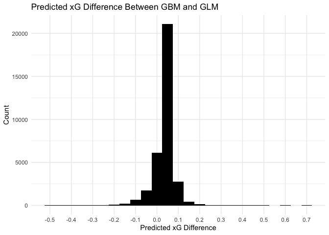<!-- -->

```r
# summarize the differences
summary(combined_set$pred_value_diff)
```

```
##     Min.  1st Qu.   Median     Mean  3rd Qu.     Max. 
## -0.51271  0.02278  0.04637  0.03740  0.06087  0.68187
```

Looking at the plot, the distribution of differences is largely centered between +- 0.15, meaning that most of the times the models are quite close on the predicted xG value. We see this also in the summary, as the IQR is from .006 to .04, meaning that the middle 50% of values are extremely close to one another. We can conclude from this that the models perform quite similar from a predicted value standpoint.

## Summary

#### Conclusion

The purpose of this analysis was in large to demonstrate how an xG model can be constructed from existing data, and how we can use SHAP values to explain model performance. In summary, a model was built that performs relatively well (being evaluated on the AUC metric) and a few features have been analyzed using SHAP values that the model deems important to understand exactly how they work. There also was a comparison between GLM and GBM models conducted through comparison of feature importance and differences in predicted values. In summary, we have multiple models that are able to predict xG well, and we understand what they use to generate predictions.

#### Takeaways

First, I was surprised at the performance of the GLM compared to the GBM - as modeling expected goals is likely a problem that is more non-linear in nature and involves interactions, the GLM was able to produce a similar AUC result as the GBM, and there are relatively small differences in predicted values between the two models. 

I was also surprised at the strong impact of creating the shot_distance feature - while I assumed that this feature would be important given the context of the modeling problem, I didn't expect to have such a large impact. 

The major takeaways is that we now have multiple models that can be used as predictors for xG, and we have an understanding of why they work well and what they use to generate predictions. 

#### Session Info

For results replication and transparency, here is the session info used at the time of analysis:


```r
sessionInfo()
```

```
## R version 4.2.3 (2023-03-15)
## Platform: x86_64-apple-darwin17.0 (64-bit)
## Running under: macOS Big Sur ... 10.16
## 
## Matrix products: default
## BLAS:   /Library/Frameworks/R.framework/Versions/4.2/Resources/lib/libRblas.0.dylib
## LAPACK: /Library/Frameworks/R.framework/Versions/4.2/Resources/lib/libRlapack.dylib
## 
## locale:
## [1] en_US.UTF-8/en_US.UTF-8/en_US.UTF-8/C/en_US.UTF-8/en_US.UTF-8
## 
## attached base packages:
## [1] parallel  stats     graphics  grDevices utils     datasets  methods  
## [8] base     
## 
## other attached packages:
##  [1] pROC_1.18.0          shapviz_0.6.0        kableExtra_1.3.4    
##  [4] caret_6.0-94         lattice_0.20-45      vip_0.3.2           
##  [7] SHAPforxgboost_0.1.1 xgboost_1.7.3.1      remotes_2.4.2       
## [10] SDMTools_1.1-222     StatsBombR_0.1.0     sp_1.6-0            
## [13] jsonlite_1.8.4       httr_1.4.5           doParallel_1.0.17   
## [16] iterators_1.0.14     foreach_1.5.2        RCurl_1.98-1.12     
## [19] rvest_1.0.3          stringi_1.7.12       devtools_2.4.5      
## [22] usethis_2.1.6        lubridate_1.9.2      forcats_1.0.0       
## [25] stringr_1.5.0        dplyr_1.1.1          purrr_1.0.1         
## [28] readr_2.1.4          tidyr_1.3.0          tibble_3.2.1        
## [31] ggplot2_3.4.1        tidyverse_2.0.0     
## 
## loaded via a namespace (and not attached):
##   [1] backports_1.4.1      shades_1.4.0         systemfonts_1.0.4   
##   [4] plyr_1.8.8           splines_4.2.3        listenv_0.9.0       
##   [7] digest_0.6.31        htmltools_0.5.5      fansi_1.0.4         
##  [10] magrittr_2.0.3       checkmate_2.1.0      memoise_2.0.1       
##  [13] BBmisc_1.13          tzdb_0.3.0           ggfittext_0.9.1     
##  [16] recipes_1.0.5        globals_0.16.2       gower_1.0.1         
##  [19] R.utils_2.12.2       svglite_2.1.1        hardhat_1.3.0       
##  [22] timechange_0.2.0     prettyunits_1.1.1    colorspace_2.1-0    
##  [25] xfun_0.38            callr_3.7.3          crayon_1.5.2        
##  [28] survival_3.5-3       glue_1.6.2           polyclip_1.10-4     
##  [31] gtable_0.3.3         ipred_0.9-14         webshot_0.5.4       
##  [34] car_3.1-2            pkgbuild_1.4.0       future.apply_1.10.0 
##  [37] abind_1.4-5          scales_1.2.1         rstatix_0.7.2       
##  [40] miniUI_0.1.1.1       Rcpp_1.0.10          viridisLite_0.4.1   
##  [43] xtable_1.8-4         proxy_0.4-27         stats4_4.2.3        
##  [46] lava_1.7.2.1         prodlim_2019.11.13   profvis_0.3.7       
##  [49] htmlwidgets_1.6.2    RColorBrewer_1.1-3   ellipsis_0.3.2      
##  [52] urlchecker_1.0.1     pkgconfig_2.0.3      R.methodsS3_1.8.2   
##  [55] farver_2.1.1         nnet_7.3-18          sass_0.4.5          
##  [58] utf8_1.2.3           labeling_0.4.2       tidyselect_1.2.0    
##  [61] rlang_1.1.0          reshape2_1.4.4       later_1.3.0         
##  [64] munsell_0.5.0        tools_4.2.3          cachem_1.0.7        
##  [67] cli_3.6.1            generics_0.1.3       broom_1.0.4         
##  [70] evaluate_0.20        fastmap_1.1.1        yaml_2.3.7          
##  [73] ModelMetrics_1.2.2.2 processx_3.8.0       knitr_1.42          
##  [76] fs_1.6.1             future_1.32.0        nlme_3.1-162        
##  [79] mime_0.12            R.oo_1.25.0          xml2_1.3.3          
##  [82] compiler_4.2.3       rstudioapi_0.14      curl_5.0.0          
##  [85] e1071_1.7-13         ggsignif_0.6.4       tweenr_2.0.2        
##  [88] bslib_0.4.2          highr_0.10           ps_1.7.3            
##  [91] Matrix_1.5-3         vctrs_0.6.1          pillar_1.9.0        
##  [94] lifecycle_1.0.3      jquerylib_0.1.4      data.table_1.14.8   
##  [97] bitops_1.0-7         gggenes_0.5.0        httpuv_1.6.9        
## [100] R6_2.5.1             promises_1.2.0.1     gridExtra_2.3       
## [103] parallelly_1.35.0    sessioninfo_1.2.2    codetools_0.2-19    
## [106] MASS_7.3-58.2        pkgload_1.3.2        withr_2.5.0         
## [109] mgcv_1.8-42          hms_1.1.3            grid_4.2.3          
## [112] rpart_4.1.19         timeDate_4022.108    class_7.3-21        
## [115] rmarkdown_2.21       carData_3.0-5        ggpubr_0.6.0        
## [118] ggforce_0.4.1        shiny_1.7.4
```


